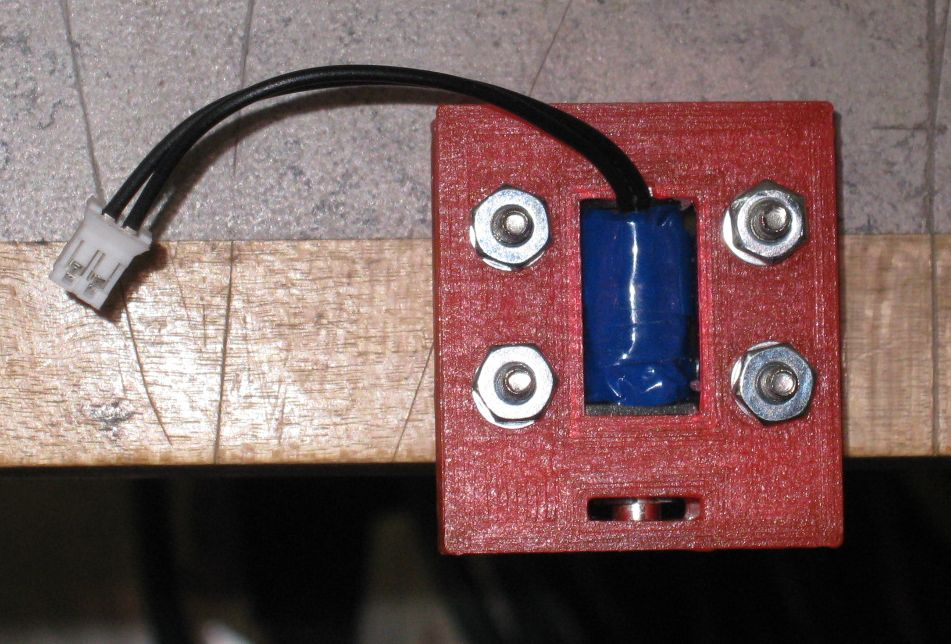
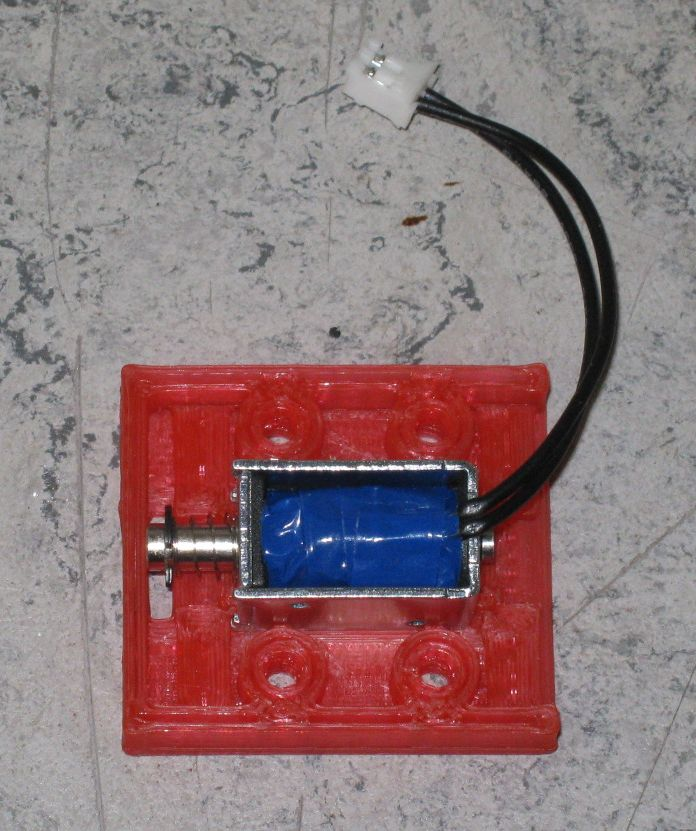
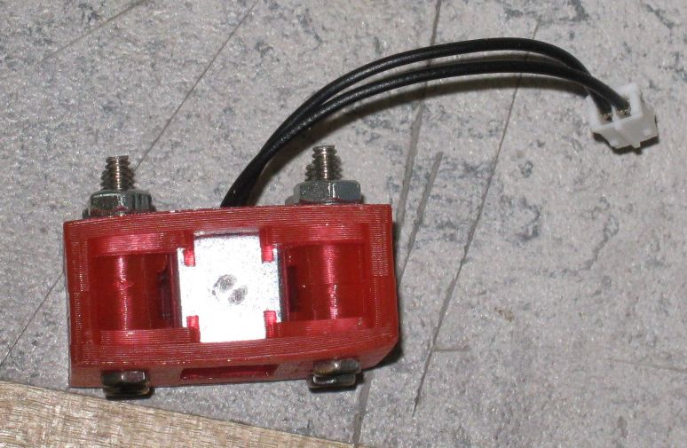
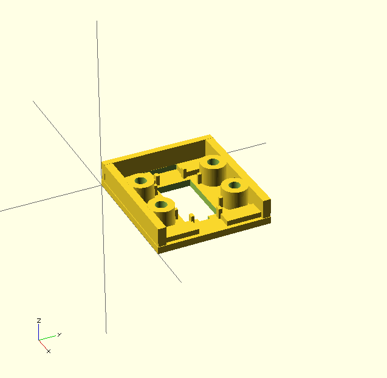

# Actuator Bracket

This bracket is intended to be used with a solenoid to creat a release mechanism.
More information about the overall project can be found at [http://members.shaw.ca/danpeircenotes2/remote-actuator.html](http://members.shaw.ca/danpeircenotes2/remote-actuator.html).

## Solenoid in Bracket

This is what the solenoid mounted in the bracket looks like.
Note that the end of the solenoid plunger is visible.

The top half of the bracket is removed to show the solenoid sitting in the bottom half.

The back end of the solenoid and bracket. 
Note alignment tabs are visible.

This is what the 3D model looks like from one angle.

	
...or it can be viewed at any angle at [3D-model/actuator-bracket.stl](3D-model/actuator-bracket.stl).
